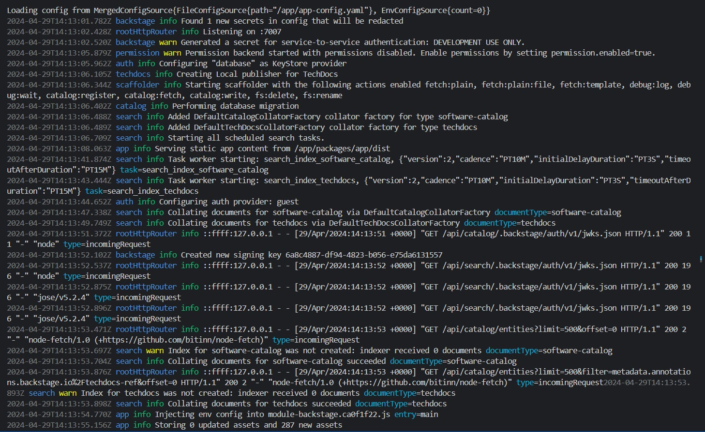

## Registro de execução:

Aplicação sendo executada na porta 7007, porta essa que foi configurada previamente no Docker

## Inicialização do Docker:

Aqui pode-se visualizar o registro da execução do docker

