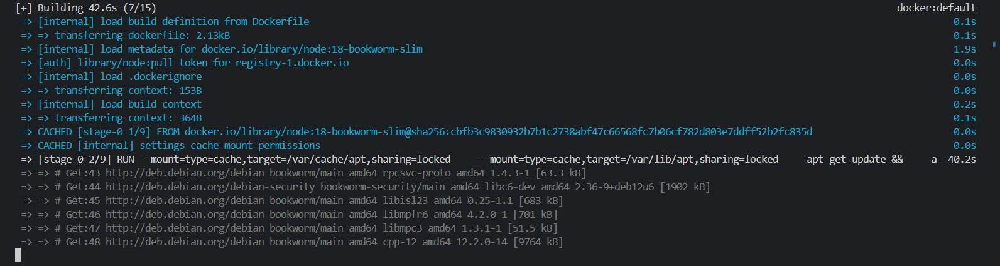

# Gestão de configuração: 

A seguir, pode-se visualizar a execução da compilação da imagem Docker

E a aqui, os logs de execução do projeto:

# Processo de replicação:

### Instalação do backstage:
 1. Executar o comando no terminal, em um diretório de sua escolha:
 ~~~
 npx @backstage/create-app@latest --skip-install
 ~~~ 
 2. Acessar o diretório da pasta criada e executar no terminal:
 ~~~
 yarn install
 ~~~

 ### Build do backstage: 
 Dentro da pasta do projeto, execute a sequencia de comandos no terminal:

 ~~~
 yarn install --frozen-lockfile
 ~~~
 ~~~
 yarn tsc
 ~~~
 ~~~
 yarn build:backend 
 ~~~

 ### Configuração do Docker: 
 Acesse o diretório em que se encontra o Dockerfile, a partir do diretório:
 ~~~
 nome_projeto\packages\backend\Dockerfile
 ~~~ 

 Acesse o arquivo Dockerfile, e substitua o código pelo a seguir:

 ~~~
FROM node:18-bookworm-slim

# Install isolate-vm dependencies, these are needed by the @backstage/plugin-scaffolder-backend.
RUN --mount=type=cache,target=/var/cache/apt,sharing=locked \
    --mount=type=cache,target=/var/lib/apt,sharing=locked \
    apt-get update && \
    apt-get install -y --no-install-recommends python3 g++ build-essential && \
    yarn config set python /usr/bin/python3

# Install sqlite3 dependencies. You can skip this if you don't use sqlite3 in the image,
# in which case you should also move better-sqlite3 to "devDependencies" in package.json.
RUN --mount=type=cache,target=/var/cache/apt,sharing=locked \
    --mount=type=cache,target=/var/lib/apt,sharing=locked \
    apt-get update && \
    apt-get install -y --no-install-recommends libsqlite3-dev

# From here on we use the least-privileged `node` user to run the backend.
USER node

# This should create the app dir as `node`.
# If it is instead created as `root` then the `tar` command below will
# fail: `can't create directory 'packages/': Permission denied`.
# If this occurs, then ensure BuildKit is enabled (`DOCKER_BUILDKIT=1`)
# so the app dir is correctly created as `node`.
WORKDIR /app

# This switches many Node.js dependencies to production mode.
ENV NODE_ENV development

# Copy repo skeleton first, to avoid unnecessary docker cache invalidation.
# The skeleton contains the package.json of each package in the monorepo,
# and along with yarn.lock and the root package.json, that's enough to run yarn install.
COPY --chown=node:node yarn.lock package.json packages/backend/dist/skeleton.tar.gz ./
RUN tar xzf skeleton.tar.gz && rm skeleton.tar.gz

RUN --mount=type=cache,target=/home/node/.cache/yarn,sharing=locked,uid=1000,gid=1000 \
    yarn install --frozen-lockfile --production --network-timeout 300000

# Then copy the rest of the backend bundle, along with any other files we might want.
COPY --chown=node:node packages/backend/dist/bundle.tar.gz app-config*.yaml ./
RUN tar xzf bundle.tar.gz && rm bundle.tar.gz

CMD ["node", "packages/backend", "--config", "app-config.yaml"]
 ~~~

### Execução do Docker: 
No diretório do projeto execute no terminal: 
~~~
docker image build . -f packages/backend/Dockerfile --tag backstage --no-cache
~~~

Com a imagem gerada, basta executar: 

~~~
docker run -it -p 7007:7007 backstage
~~~

Agora visualize funcionando no http://localhost:7007

# Evidência da aplicação sendo executada com prints no arquivo markdown.

### Tela inicial:

 

### Catalogo de serviços:

 

### Dashboard de API's:

 

### Documentações:

 

### Criação de componentes:

 

### Radar Tech:

 

### Configurações:

 